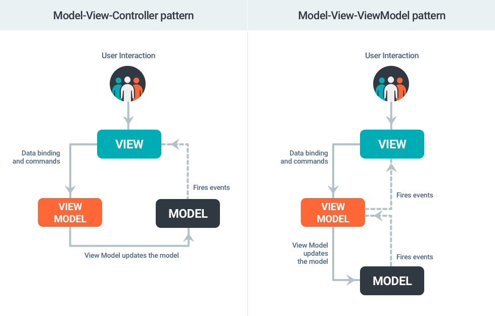
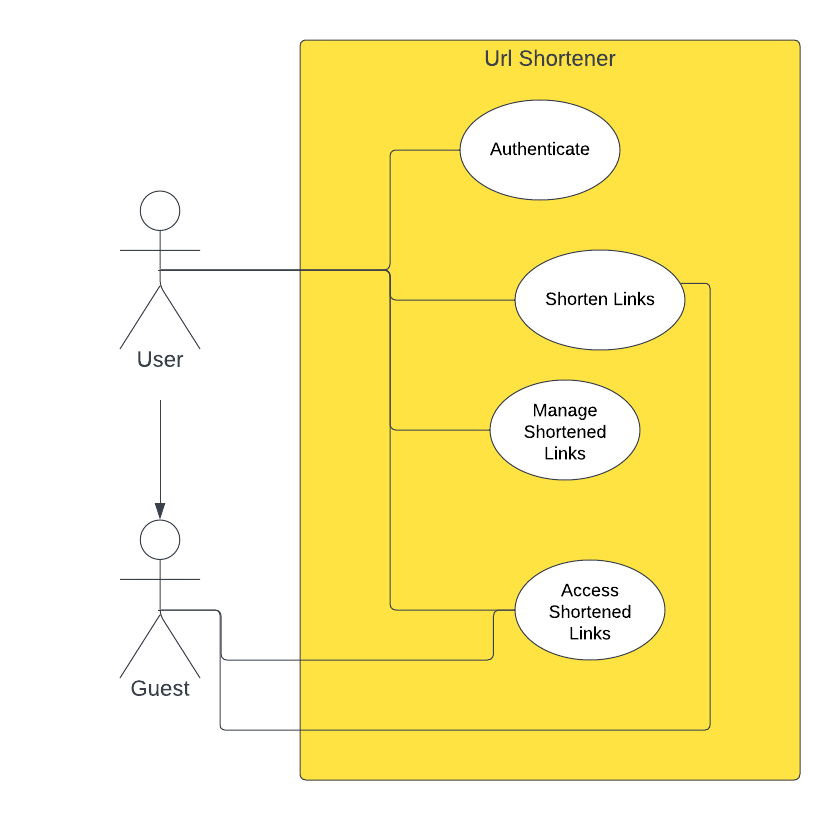
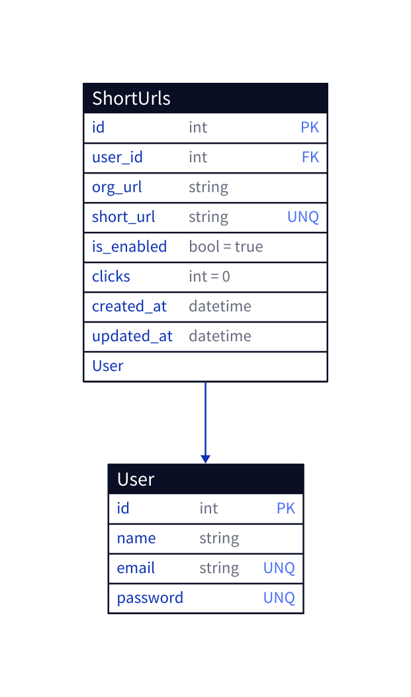
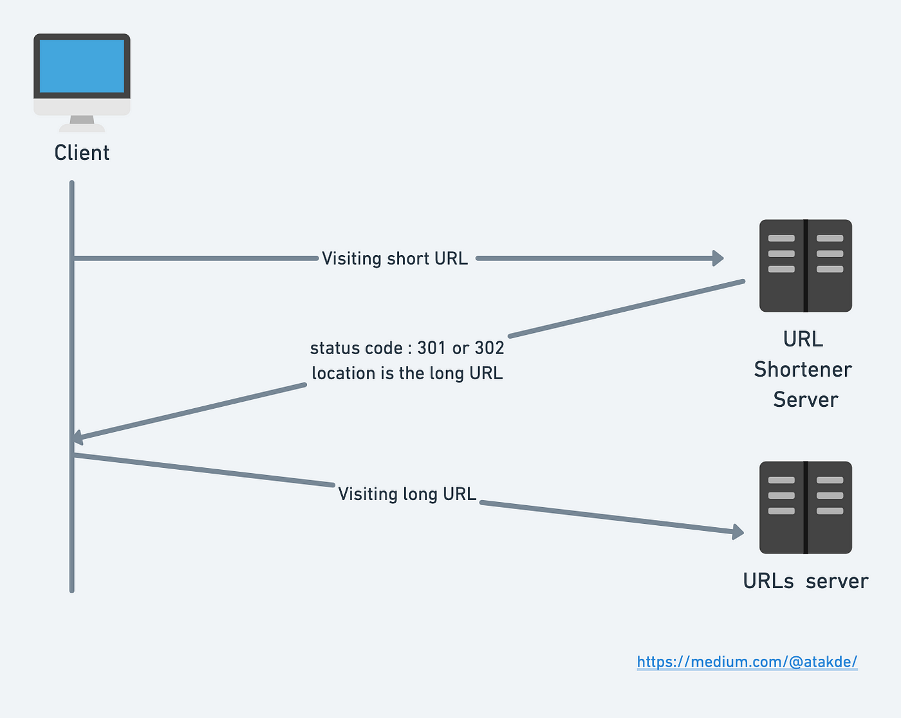

# About
---
<p align="center"><a href="https://laravel.com" target="_blank"></a></p>

<p align="center">
<a href="https://packagist.org/packages/laravel/framework"></a>
<a href="https://packagist.org/packages/laravel/framework"></a>
<a href="https://packagist.org/packages/laravel/framework"></a>
</p>

## Laravel

Laravel is a popular open-source PHP web application framework known for its elegant syntax and developer-friendly features. It follows the Model-View-Controller (MVC) architectural pattern, making it easy to build scalable and maintainable web applications. Laravel provides a wide range of features, including routing, database ORM, authentication, caching, and more. It emphasizes simplicity, expressive code, and developer productivity, making it a preferred choice for building modern web applications.

<p dir="auto" align="center"><a href="https://vuejs.org" rel="nofollow"></a></p>

<p dir="auto" align="center">
  <a href="https://circleci.com/gh/vuejs/vue/tree/dev" rel="nofollow"></a>
  <a href="https://codecov.io/github/vuejs/vue?branch=dev" rel="nofollow"></a>
  <a href="https://npmcharts.com/compare/vue?minimal=true" rel="nofollow"></a>
  <a href="https://www.npmjs.com/package/vue" rel="nofollow"></a>
  <a href="https://www.npmjs.com/package/vue" rel="nofollow"></a>
  <a href="https://chat.vuejs.org/" rel="nofollow"></a>
</p>

## Vue.js

Vue.js is a progressive JavaScript framework for building user interfaces. It focuses on the view layer of an application and allows developers to create interactive and dynamic web interfaces with ease. Vue.js is lightweight, flexible, and has a gentle learning curve, making it a popular choice for both small and large-scale projects. It provides features such as data binding, component-based architecture, reactivity, and a robust ecosystem of plugins and libraries. With Vue.js, you can create responsive and engaging user interfaces while enjoying efficient development and performance.

> 💡 Both Laravel and Vue.js complement each other seamlessly, allowing developers to build powerful full-stack applications with a smooth integration between the backend and frontend. Laravel provides the server-side infrastructure, API endpoints, and business logic, while Vue.js handles the dynamic user interfaces and interactive components. Together, they enable developers to create modern, scalable, and efficient web applications.

Certainly! Here's a README file in markdown style for your URL shortener application:

## URL Shortener App - Laravel, Vue.js, and Inertia.js

<p align="center">

  

  <center>

 [](https://forge.laravel.com/servers/690134/sites/2006348)
  </center>
</p>

This repository contains the code for a URL shortener application built using Laravel, Vue.js, and Inertia.js.


## Project Overview

The URL shortener app allows users to shorten long URLs into more compact ones, making it easier to share and manage links. The application is built using the following technologies:

- **Laravel:** A powerful PHP framework for building web applications.
- **Vue.js:** A JavaScript framework for building user interfaces.


# Opted Design Pattern
---


A combination of the MVC (Model-View-Controller) pattern on the Laravel backend and the MVVM (Model-View-ViewModel) pattern on the Vue.js frontend.

### Backend (Laravel)


- MVC (Model-View-Controller): Laravel's backend architecture separates concerns into three main components:
  - Model: Represents data structures and handles interactions with the database.
  - View: Displays the user interface.
  - Controller: Handles the application logic, receives user input, interacts with models, and returns responses.

### Frontend (Vue.js)

- MVVM (Model-View-ViewModel): Vue.js frontend architecture separates concerns into three main components:
  - Model: Represents the data structures specific to the frontend.
  - View: Defines UI components and templates.
  - ViewModel: Acts as an intermediary between views and models, handling business logic, data manipulation, and API calls to the backend.

<center>


</center>

# App Use Case :
---




**User:**

The User actor refers to an authenticated user who has an account within the URL shortener app. As a User, they can perform the following actions:

- Shorten URLs: The User can enter a long URL and generate a shortened version of it.
- View Shortened URLs: The User can access a list of their previously shortened URLs.
- Track Statistics: The User can view various statistics related to their shortened URLs, such as the number of clicks.
- Manage Shortened URLs: The User can delete their existing shortened URLs as needed.

**Guest:**

The Guest actor refers to users who visit the URL shortener app without authenticating or having an account. As a Guest, they can perform the following actions:

- Shorten URLs: The Guest can enter a long URL and generate a shortened version of it.
- Use Shortened URLs: The Guest can utilize the shortened URLs for their intended purposes, such as sharing them on social media or including them in messages.
- No Tracking or Statistics: Unlike the authenticated User, the Guest does not have access to tracking or statistics related to the shortened URLs they generate. They cannot view the number of clicks or any other analytics information.

By distinguishing between User and Guest actors, the URL shortener app provides additional functionality and features for authenticated users while still allowing unauthenticated users to utilize the basic URL shortening capabilities. This differentiation enables the app to cater to the needs of both types of users effectively.

# Data Base Scheme :
---



# Shortening Approach :
---


```php
	public function short(ShortRequest $request)
	{
		if ($request->orginal_url) {
			if (Auth::user()) {
				$new_url = Auth::user()
					->links()
					->create([
						'org_url' => $request->orginal_url,
					]);
			} else {
				$new_url = ShortUrl::create([
					'org_url' => $request->orginal_url,
				]);
			}
			if ($new_url) {
				$short_url = Str::random(6);
				$new_url->update([
					'short_url' => $short_url,
				]);
				$shortUrl = url('shorten/' . $short_url);
				return Inertia::render('Welcome', [
					'url' => $shortUrl,
					'canLogin' => Route::has('login'),
					'canRegister' => Route::has('register'),
				]);
			}
			return Redirect::to('/');
		}
	}

```

The provided code represents the process of shortening a URL. It checks if the original URL is provided and then creates a new link record. If an authenticated user is present, the link record is associated with their account; otherwise, it is created directly. A randomly generated short URL code is assigned to the link record, and the short URL is constructed. Finally, a response is returned, likely using the Inertia.js framework, rendering a welcome view with the shortened URL displayed. The code allows authenticated users to track their shortened URLs, while unauthenticated users can generate short URLs without tracking or statistics.

## Routing and Url Redirection :

```php
Route::get('/shorten/{short_url}', [ShortUrlController::class, 'redirect'])->name('shorten.redirect');

...

	public function redirect($short_url)
	{
		$short_url = ShortUrl::where('short_url', $short_url)->first();
		if ($short_url->is_enabled) {
			$short_url->increment('clicks');
			return Redirect::to(url($short_url->org_url));
		}
		// TODO add error page
		return Redirect::to('/');
	}
```

When a GET request is made to the `'/shorten/{short_url}'` route, the `redirect()` method is invoked. Inside the method, it retrieves the corresponding `ShortUrl` record based on the provided `short_url` parameter. If the short URL is enabled, it increments the `clicks` counter for that URL and redirects the user to the original URL. Otherwise, if the short URL is not enabled, it redirects the user to the homepage.

# 🥳 That's it!
---


# 📚 Resources
---

- vuejs docs : [link](https://vuejs.org/v2/guide/)

- Inertia.js - The Modern Monolith : [link](https://inertiajs.com/)

- Laravel docs : [link](https://laravel.com/docs/10.x/installation)
-   Flowbite - Tailwind CSS component library  :[Link](https://flowbite.com/docs/)
- Laravel Vite+Vue.js configuration : [link](https://laravel.com/docs/10.x/vite#vue)

- Laravel Vue.js : [link](https://laravel.com/docs/10.x/frontend#using-vue-react)

- Install Vue 3 on Laravel 9 with Vite - Laravel VueJS Tutorial : [link](https://www.youtube.com/watch?v=E9ZluStP_eY)

# Contributing
---
Contributions are welcome! If you find any issues or want to enhance the URL shortener app, feel free to open a pull request.

Please make sure to follow the [code of conduct](CONTRIBUTING.md) when contributing to this project.
# License
---
The URL shortener app is open-source and available under the [MIT License](LICENSE).

# Acknowledgements
---
Special thanks to the creators and maintainers of Laravel, Vue.js, and Inertia.js for providing the amazing tools and libraries used in this project.

# Contact
---
For any questions or inquiries, please contact [yassernabouzi@ynabouzi.me](mailto:yassernabouzi@ynabouzi.me).