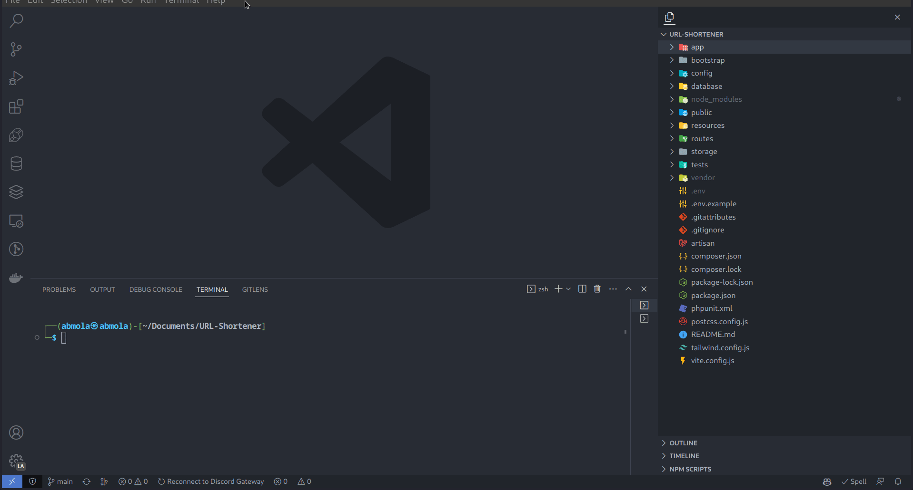

# About
---

## Laravel

Laravel is a popular open-source PHP web application framework known for its elegant syntax and developer-friendly features. It follows the Model-View-Controller (MVC) architectural pattern, making it easy to build scalable and maintainable web applications. Laravel provides a wide range of features, including routing, database ORM, authentication, caching, and more. It emphasizes simplicity, expressive code, and developer productivity, making it a preferred choice for building modern web applications.

  
  
  
  
  
  

## Vue.js

Vue.js is a progressive JavaScript framework for building user interfaces. It focuses on the view layer of an application and allows developers to create interactive and dynamic web interfaces with ease. Vue.js is lightweight, flexible, and has a gentle learning curve, making it a popular choice for both small and large-scale projects. It provides features such as data binding, component-based architecture, reactivity, and a robust ecosystem of plugins and libraries. With Vue.js, you can create responsive and engaging user interfaces while enjoying efficient development and performance.

> 💡 Both Laravel and Vue.js complement each other seamlessly, allowing developers to build powerful full-stack applications with a smooth integration between the backend and frontend. Laravel provides the server-side infrastructure, API endpoints, and business logic, while Vue.js handles the dynamic user interfaces and interactive components. Together, they enable developers to create modern, scalable, and efficient web applications.

# Setup
---

Alright, it's time to embark on the magical journey of setting up your Laravel Vue.js application! But fear not, for I shall be your trusty guide.

# Used Technologies

# Opted Design Pattern

# 🥳 That's it!
---
You should now have a Laravel Vue.js application set up and ready to use on both Linux and Windows systems.

# 📚 Resources
---
- Laravel Vite+Vue.js configuration : [link](https://laravel.com/docs/10.x/vite#vue)

- Laravel Vue.js : [link](https://laravel.com/docs/10.x/frontend#using-vue-react)

- Install Vue 3 on Laravel 9 with Vite - Laravel VueJS Tutorial : [link](https://www.youtube.com/watch?v=E9ZluStP_eY)